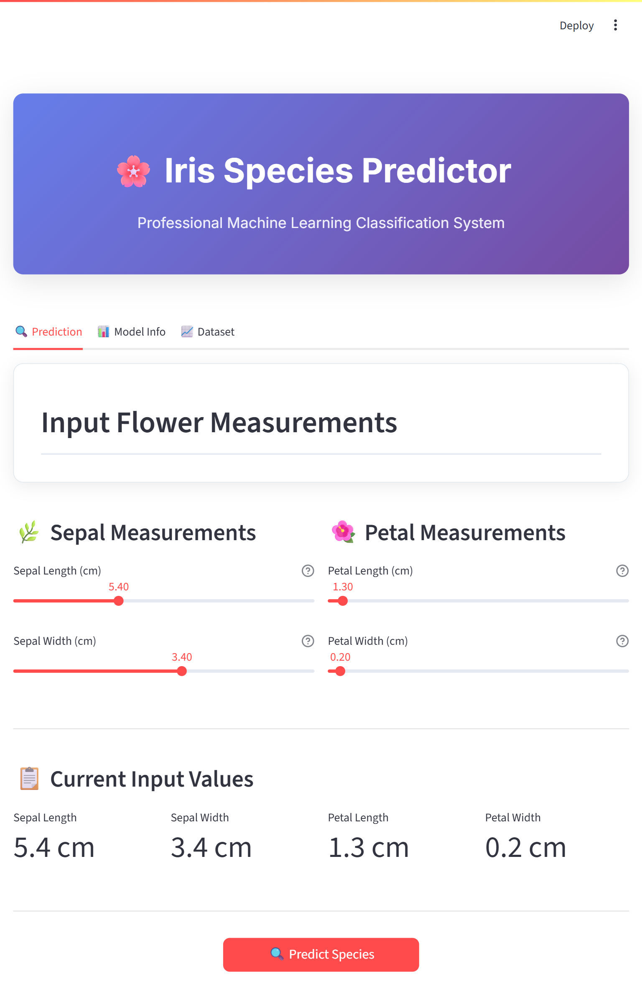

# 🌸 Iris Species Prediction with KNN and Streamlit

A simple yet powerful **machine learning web application** that predicts the species of an **Iris flower** using a trained **K-Nearest Neighbors (KNN)** model. The user interface is built using [Streamlit](https://streamlit.io/),  making it easy to interact with the model through a browser.

---

## System UI



## 🧠 About the Project

This project demonstrates a complete machine learning pipeline from data preprocessing to model training and deployment in a web app:

- **Dataset**: [Iris dataset](https://scikit-learn.org/stable/modules/generated/sklearn.datasets.load_iris.html) 
- **Model**: K-Nearest Neighbors (KNN) classifier
- **Preprocessing**: Feature scaling using `StandardScaler`
- **Deployment**: Interactive UI via Streamlit

The model classifies flowers into one of three species:
- **Setosa**
- **Versicolor**
- **Virginica**

---

## 📦 Features

✅ Trained KNN model with high accuracy  
✅ Feature scaling using `StandardScaler`  
✅ Serialized model and scaler for deployment  
✅ Interactive UI with numeric inputs for precise entry  
✅ Real-time prediction on button click  
✅ Model performance shown in sidebar  

---

## 🛠️ Requirements

Before running this application, ensure the following dependencies are installed:

| Dependency       | Suggested Version |
|------------------|-------------------|
| Python           | 3.8+              |
| Streamlit        | latest            |
| scikit-learn     | latest            |
| numpy            | latest            |
| pandas           | latest            |
| joblib           | latest            |

You can install them using:

```bash
pip install streamlit scikit-learn numpy pandas joblib

```bash
pip install -r requirements.txt
```
---
## 🚀 How to Run
1. Clone the repository:
   ```bash
   git clone <https://github.com/ArunPandeyLaudari/KNN-Iris-Classification.git>

    cd iris_species_prediction
    ```
2. Navigate to the project directory:
   ```bash
    cd iris_species_prediction
    ```
3. Run the Streamlit app:
    ```bash
    streamlit run app.py
    ```
4. Open your browser and go to `http://localhost:8501` to view the app.
---